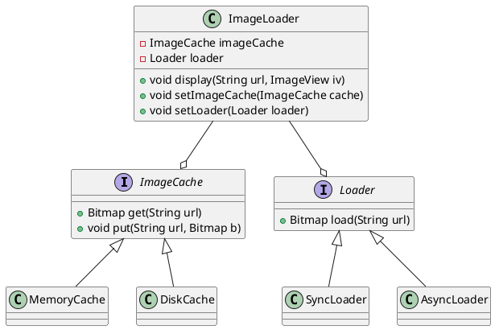
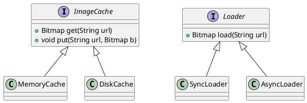
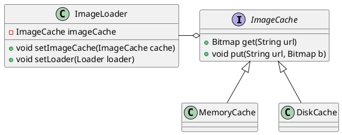
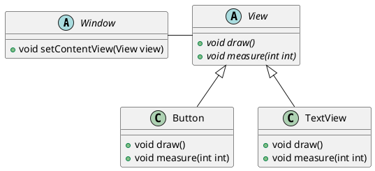
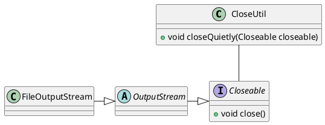

# 六大原则简单描述

1. 单一职责原则：一个类中应该是相关性很强的一类函数。
2. 开闭原则：对扩展开放，对修改封闭。实现扩展的方法是使用抽象和依赖注入。将可扩展的功能抽象，然后通过外部注入具体实现。
3. 里氏替换原则：所有父类都能被子类替换，并且不影响程序的正确运行。核心是建立抽象，结合开闭原则，对扩展开放，对修改关闭。
4. 依赖倒置原则：面向抽象编程。高层模块是调用方，底层模块是实现方。模块间的依赖通过抽象发生，实现类之间不发生直接的依赖关系，其依赖关系是通过接口或抽象类产生的。核心要点：
    * 高层模块不应该依赖底层模块，两者都应该依赖其抽象
    * 抽象不应该依赖细节：接口或抽象类，不用在意具体的实现
    * 细节应该依赖抽象：由实现类去具体实现抽象
5. 接口隔离原则：客户端依赖的接口应尽可能的小。比如：实现一个工具类来关闭所有支持 `Closeable` 的对象，该工具类就应该只依赖 `Closeable` 这个抽象的接口，而不是 `OutputStream` 等具体的实现或与 Stream 相关的其他接口
6. 迪米特原则：一个对象应该对其他对象有最少的了解，只与直接的朋友通信。尽量保持类的依赖关系是一条没有交叉，没有环的线。

模拟一个图片加载的库 `ImageLoader` ,做应用示例. 下面是类图:

## 单一职责原则

> 一个类中应该是相关性很强的一类函数.

比如 `ImageLoader` 提供了图片加载和缓存的功能,但是我们不能将加载和缓存的功能全写到 `ImageLoader` 类里, 于是提出两个功能类 `ImageCache` 和 `Loader` 分别负责缓存和加载功能.

## 开闭原则

> 对扩展开放，对修改封闭。实现扩展的方法是使用抽象和依赖注入。将可扩展的功能抽象，然后通过外部注入具体实现.

负责缓存的 `ImageCache` 和加载的 `Loader`, 都是可以扩展的功能, 应该让他们开放. `ImageLoader` 本身的业务一般都不会改变, 应该让它封闭.

所以将缓存和加载功能抽象出来, 形成两个接口, 然后在外边注入具体的实现. 要扩展他们的功能, 就实现他们的抽象接口即可, 然后注入到 `ImageLoader` 中. 比如缓存可以分内存缓存 `MemoryCache` 和硬盘缓存 `DiskCache`.

## 里氏替换原则

> 所有父类都能被子类替换，并且不影响程序的正确运行。核心是建立抽象，结合开闭原则，对扩展开放，对修改关闭.

`MemoryCache` `DiskCache` 都能**替换** `ImageCache` 的工作,  并且能够保证行为的正确性, `ImageCache` 建立了获取缓存图片, 储存缓存图片的接口规范, `MemoryCache` 等根据规范实现了相应的功能, 用户只需在使用时指定具体的缓存对象, 就可以动态替换 `ImageLoader` 中的缓存策略.

比如 Android SDK 里的 `Window` 和 `View` 也是这个原则, `Window` 中的 `setContentView`的参数 `view` 可以被任何一个实现了 `View` 接口的对象替换.

## 依赖倒置原则

> 高层模块是调用方，底层模块是实现方。高层模块不依赖底层模块的实现细节, 依赖模块被颠倒. 模块间的依赖通过抽象发生，实现类之间不发生直接的依赖关系，其依赖关系是通过接口或抽象类产生的.

* 高层模块不应该依赖底层模块，两者都应该依赖其抽象
* 抽象不应该依赖细节：接口或抽象类，不用在意具体的实现
* 细节应该依赖抽象：由实现类去具体实现抽象

例子中的高层模块就是 `ImageLoader`, 底层模块就是 `ImageCache` 和 `Loader`, `ImageLoader` 依赖的都是 `ImageCache` 和 `Loader` 的抽象, 并没有直接依赖某个具体实现.

如果 `ImageLoader` 直接依赖了 `ImageCache` 的某一个具体实现(比如 `MemoryCache`), 当 `MemoryCache` 不能满足 `ImageLoader` 而需要被其他缓存实现替换时, 就必须修改 `ImageLoader` 的代码. 反之, 如果 `ImageLoader` 依赖的是 `ImageCache` 抽象, 要替换其他缓存实现时, 只需要外部注入其他实现即可, 不需要修改 `ImageLoader`的代码.

## 接口隔离原则

> 依赖的抽象接口应尽可能的小。比如：实现一个工具类来关闭所有支持 `Closeable` 的对象，该工具类就应该只依赖 `Closeable` 这个抽象的接口，而不是 `FileOutputStream` 等具体的实现.

## 迪米特原则

> 一个对象应该对其他对象有最少的了解，只与直接的朋友通信。尽量保持类的依赖关系是一条没有交叉，没有环的线.

