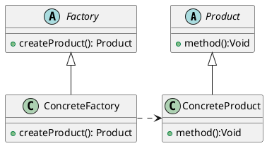

## 使用场景

> 在需要生成复杂对象的地方，可以使用工厂方法模式。定义一个创建对象的接口，让子类工厂决定创建怎样的类。

## 类图



- Product: 工厂将生产的产品的抽象
- ConcreteProduct: 一种具体的产品
- Factory: 工厂的抽象，定义了生产产品的方法
- ConcreteFactory: 生产某种具体产品的工厂

## 实现方式

情景:

使用工厂方法模式，实现一个鞋厂的程序。

定义了鞋子和鞋子工厂的抽象，并实现了雪地鞋和运动鞋两种产品。

```java
abstract class Shoes {
    abstract String name();
}

public abstract class ShoesFactory {
    abstract Shoes createShoes();
}

class SportShoes extends Shoes {

    @Override
    String name() {
        return "Sport Shoes";
    }
}

class SnowShoes extends Shoes {

    @Override
    String name() {
        return "Snow Shoes";
    }
}
```

### 多个具体的工厂

针对每个产品定义一个工厂类

```java
class SportShoesFactory extends ShoesFactory {

    @Override
    SportShoes createShoes() {
        return new SportShoes();
    }
}

class SnowShoesFactory extends ShoesFactory {

    @Override
    SnowShoes createShoes() {
        return new SnowShoes();
    }
}
```

### 一个工厂

定义一个工厂类，通过反射实现不同产品的创建

修改抽象工厂:

```java
public abstract class ShoesFactory {
    abstract <T extends Shoes> T createShoes(Class<T> clazz);
}
```

```java
class ShangHaiShoesFactory extends ShoesFactory {

    @Override
    <T extends Shoes> T createShoes(Class<T> clazz) {
        try {
            return clazz.getDeclaredConstructor().newInstance();
        } catch (Exception e) {
            e.printStackTrace();
        }
        return null;
    }
}
```

## 静态工厂方法

> 有时能确保只有一种工厂，并不需要创建一个抽象工厂时，可以创建一个普通的工厂类，提供创建对象的方法。